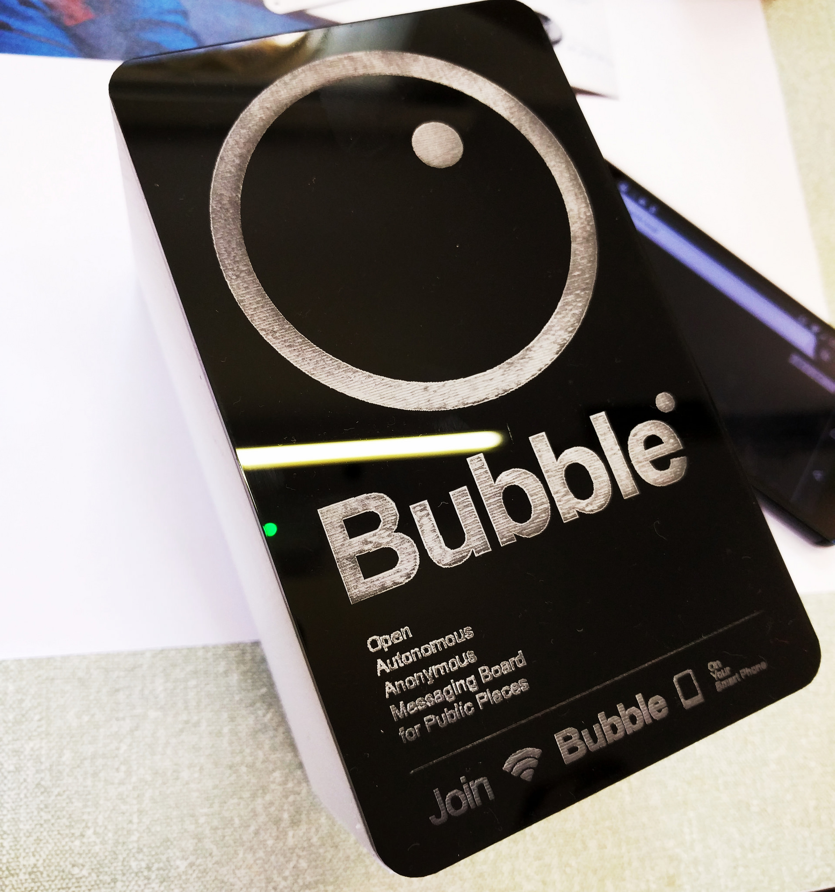

# Bubble

### An open, autonomous, anonymous messaging board for public places. Using a wifi hotspot, Bubble creates an invisible layer for hyper-local conversations in disconnected spaces.

*By Katie Caldwell, Julia Gratsova, Vladan Joler, Dietrich Ayala at the Mozilla Open IoT Design Sprint in Anstruther, June 2016*

